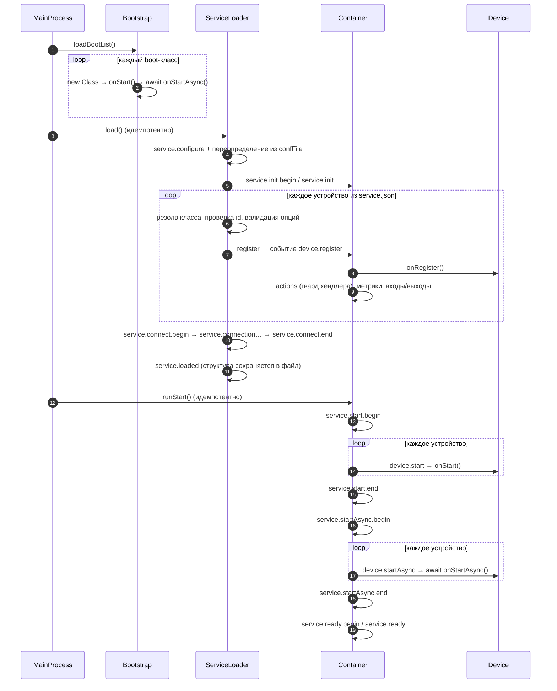
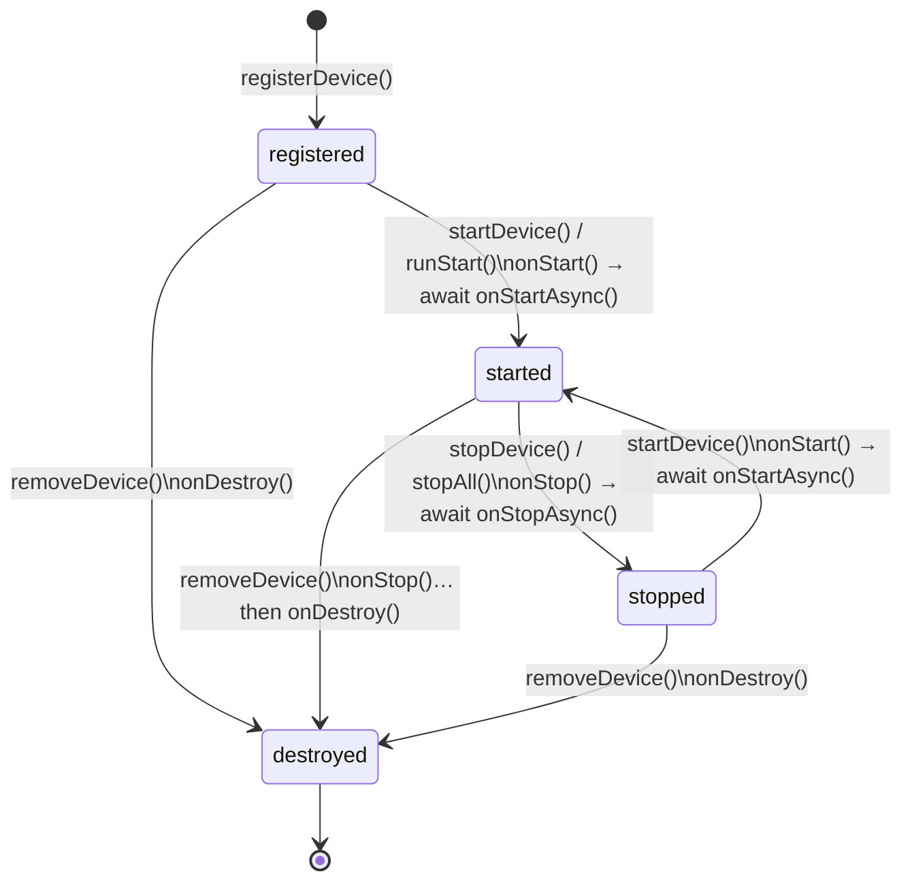

# 01 — Архитектура

У вас есть `service.json` — список устройств и соединений между ними. Всё, что делает фреймворк, — превращает этот JSON в работающий сервис: поднимает устройства, проверяет их опции, соединяет порты, запускает, передаёт данные между устройствами и сохраняет состояние. Здесь — как это устроено и кто за что отвечает. Глоссарий — [00-Overview](00-Overview.md).

## Из чего состоит система

Снаружи вы видите один объект — `MainProcess`. Создаёте его, передаёте JSON и список служебных модулей, вызываете `run()`, и он поднимает всё сам. Внутри у него три помощника, и важно понять, какую задачу закрывает каждый, — они не пересекаются, и именно это делает систему собранной.

Начнём с того, что стоит позади устройствами. `Bootstrap` отвечает за инфраструктуру: до того, как заработают сами устройства, сервису нужны места, куда складывать состояние, метрики и структуру. `MainProcess` отдаёт `Bootstrap` список boot-классов, а тот создаёт каждый и протягивает ему контейнер — после этого модуль живёт на событиях и об устройствах не знает вообще.

`ServiceLoader` — это сборка. Он берёт JSON, находит класс каждого устройства, проверяет опции и создаёт устройство **внутри контейнера**, а затем соединяет порты. Ключевой момент, который стоит держать в голове: `ServiceLoader` работает с контейнером, а не вместо него. Он не запускает устройства и не обслуживает их — он только собирает их внутри. За добавление и удаление устройств в уже работающем сервисе отвечает он же.

`Container` — рантайм. Запускает устройства, передаёт данные между их портами, выполняет действия (actions), хранит состояние и разлетается событиями наружу. Любое действие устройства проходит через него.

Цепочка, которую стоит запомнить: `MainProcess` создаёт `Bootstrap`, `Container` и `ServiceLoader`; `ServiceLoader` собирает устройства внутри контейнера; `Container` запускает их и обслуживает дальше. Связаны они только контейнером и событиями, поэтому заменить один блок — не сломать остальные.

## Как сервис поднимается

Первый ход — за инфраструктурой. `Bootstrap` берёт список, который вы дали, находит класс каждого модуля, создаёт его и протягивает контейнер. После этого модули готовы ловить события, а устройств пока не существует.

Дальше подключается сборка. `ServiceLoader` начинает строить сервис из JSON. Если вы дали `confFile`, он сначала подмешивает опции из него — это позволяет поднимать один и тот же сервис в разных средах, не правя код. По этому поводу уходит событие `service.configure`.

Затем устройства создаются строго по одному, в порядке из JSON. Для каждого: находит класс по `type`, проверяет, что `id` корректен и ещё не занят, создаёт объект устройства, даёт вам шанс подготовить значения через `prepareOptions()`, а после этого **проверяет опции** по правилам из `checkOptions()`. Плохая опция роняет запуск именно здесь, с понятной ошибкой, — сервис дальше не поднимается. Если опции валидны, устройство отдаётся контейнеру, который его регистрирует: вызывает `onRegister()`, включает авто-рендер `shares`, проверяет, что у каждой объявленной action есть хендлер, регистрирует метрики и создаёт входы и выходы. На этом устройство уже существует, но ещё не запущено.

Потом `ServiceLoader` соединяет порты — каждое соединение из JSON становится реальной связью. С этого момента, когда счётчик положит значение на выход `result`, оно само дойдёт до входа `on` лампы, без участия вашего кода.

Когда все устройства созданы и соединены, уходит событие `service.loaded` — структура записывается в файл. Это же событие сработает при любом будущем изменении состава сервиса.

Осталось запустить, и здесь порядок важен. Сначала `onStart()` у **всех** устройств — синхронная фаза, в которой все уже «включены» и могут поговорить друг с другом. А потом `await onStartAsync()` у **всех** — медленная инициализация. Такой расклад позволяет каждому сделать свою долгую работу, не блокируя остальных. После этого уходят события `service.ready.begin` и `service.ready`, и сервис работает.

Два момента, которые важно знать. Повторный `run()` безопасен: и `load()`, и `runStart()` идемпотентны, уже стартовавшие устройства просто пропускаются. И любое падение на этом пути — это `CoreError` с устойчивым кодом, полный список — [08-Errors](08-Errors.md).

Полная последовательность событий зафиксирована здесь — только в этом документе:

## Как данные движутся

Правило одно и то же на всех каналах: устройство не знает об инфраструктуре. Оно просто шлёт событие, а служебные модули делают с ним, что хотят. Именно поэтому устройство можно писать, не думая о том, где оно лежит и кто его читает.

**Между устройствами — порты.** Устройство выдало значение на выход — `this.ports.output.result.push(42)`. Значение уходит ко всем входам, подключённым к этому выходу; один выход может питать много входов. На входе сначала спрашивается, есть ли у устройства хендлер: если да, он вызывается и поток на этом входе заканчивается. Если хендлера нет, но к входу прикреплены одноразовые слушатели, данные уходят к ним один раз и пробрасываются дальше. Если и того, и другого нет, вход прозрачный — данные идут дальше к подключённым устройствам. Тут есть нюанс про статус: остановленное устройство не принимает, потому что порты видят его статус и дропят `push`; а вот не-запущенное, `registered`, остановленным не считается — его порты активны, и старт-трафик проходит. Actions на не-запущенное устройство отклоняются с кодом `CONT_DEVICE_STOPPED`.

**Снаружи — actions.** Вызов снаружи выглядит как `await container.deviceAction('Lamp1', 'set.value', { value: 42 })`. Аргументы сначала проверяются по правилам, которые устройство объявило: при любой ошибке action не выполняется вообще, «половинчатых» состояний нет. Если всё ок, вызывается хендлер, и возвращаемое значение приходит вам обратно — actions можно `await`-ить.

**Быстрые данные — shares.** Для данных, которые устройство хочет отдать «вживую» — экран, дашборд, — есть `shares`. Вы меняете `this.shares = { on: true, brightness: 200 }`, а затем явно вызываете `this.render()` — без этого вызова событие не уйдёт. Событие `device.render` несёт живую ссылку на `shares`, поэтому подписчик обязан считать её read-only и при необходимости клонировать сам. Подробности — [03-Device](03-Device.md).

**Метрики.** `this.metric('count', 12, 'max')` шлёт событие `device.metric`, и модуль `DeviceMetrics` пишет его в базу. Метрики регистрируются один раз, при регистрации устройства — дальше идут только записи.

**Состояние — storage.** `this.storage.count = 12` кладёт значение в состояние, а `this.save()` отправляет событие `device.save`. Модуль `DeviceFileStorage` пишет файл — через временный файл и переименование, чтобы файл не оборвался наполовину. Читается при старте и при hot-добавлении устройства.

**Ошибки.** Устройство сообщает об ошибке событием `device.error`; о критической — `device.terminate`, который само по себе не останавливает устройство. Служебный модуль сообщает системную ошибку — событие `system.error`. Все ошибки ядра — `CoreError` с кодами, список — [08-Errors](08-Errors.md).

## Как меняется работающий сервис

Сервис можно менять, пока он работает, — останавливать его не нужно. Когда добавляют устройство, оно проходит те же проверки, что и при старте, регистрируется в контейнере и запускается; если у этого `id` уже был файл состояния, устройство встречает его. Когда удаляют устройство, это необратимо: если оно работало, сначала останавливается, затем вызывается `onDestroy()`, затем оно стирается из контейнера — при этом файл его состояния остаётся на диске, и это намеренно. Остановить устройство — обратимо: идут `onStop()` и `onStopAsync()`, статус становится `stopped`, а запустить снова — `onStart()` и `onStartAsync()` ещё раз. И, наконец, в работающем сервисе можно подключить ещё одно соединение между портами. После любого из этих изменений срабатывает `service.loaded`, и структура пересохраняется в файл.

## Жизненный цикл устройства

Устройство рождается при регистрации, живёт в запущенном состоянии, может останавливаться и запускаться снова, и в какой-то момент уничтожается. Флаг `running` — производный: он `true`, когда устройство `started`, и это то, на что смотрят порты и actions. Подробности про хуки каждого перехода — [03-Device](03-Device.md).

## Где продолжить

Как писать устройство — [03-Device](03-Device.md); порты, actions и метрики подробнее — [04-Ports-Actions-Metrics](04-Ports-Actions-Metrics.md); внутренности контейнера — [06-Container](06-Container.md); boot-классы — [07-Bootstrap](07-Bootstrap.md); все коды ошибок — [08-Errors](08-Errors.md); полный публичный API — [11-API](11-API.md).
