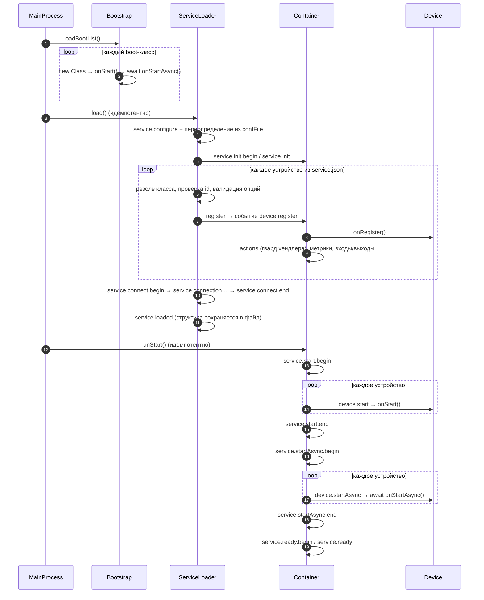
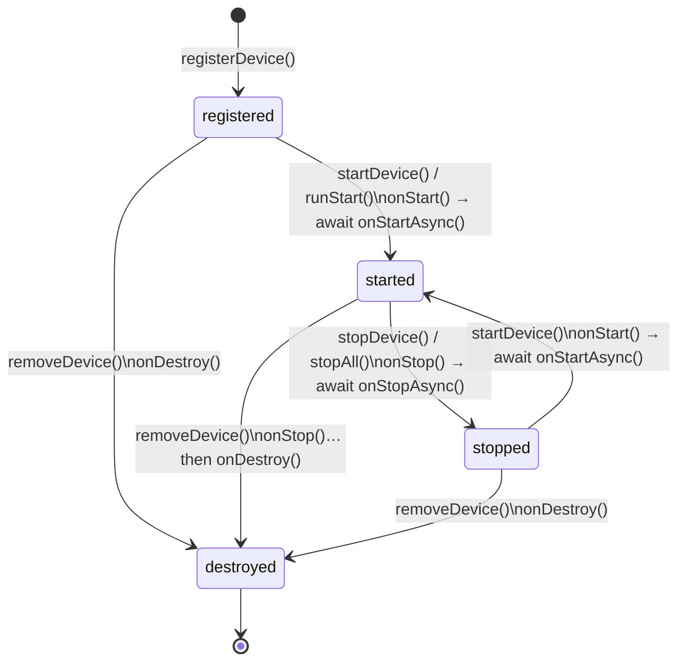

# 01 — Архитектура

> **Зачем читать:** понять, как работает фреймворк: что происходит при старте, кто за что отвечает и куда текут данные.
> **Кому:** всем, кто работает с ядром.
> **Важно:** стартовая последовательность описана **только здесь** — остальные документы ссылаются на этот раздел.
>
> ← [00-Overview](00-Overview.md) · [Далее: 02-AppStructure](02-AppStructure.md) →

## Общая картина

В ядре четыре основных участника (кто есть кто — [00-Overview](00-Overview.md)). Их разделение строгое — каждый делает своё дело и не лезет в чужое:

| Участник | Отвечает за | Не отвечает за |
|---|---|---|
| `MainProcess` | Порядок запуска: сначала служебные модули, потом сервис, потом старт устройств | — |
| `Bootstrap` | Служебные модули (boot-классы): хранилище, метрики, структура, база данных | Устройства — о них не знает вообще |
| `ServiceLoader` | **Сборка** сервиса из JSON: находит классы устройств, проверяет опции, соединяет порты; добавляет/удаляет устройства в работающем сервисе | Запуск устройств |
| `Container` | **Запуск** устройств, передача данных и событий, выполнение действий (actions), хранение состояния | Создание устройств |

Почему такое разделение? «Собрать сервис» (лоадер) и «обслуживать сервис» (контейнер) — две разные работы. Благодаря этому любую из частей можно заменить, не ломая другую: например, свой контейнер можно указать через `ContainerClass` — лоадер даже не заметит.

Где что лежит в коде:

| Что | Файл |
|---|---|
| Точка входа (`MainProcess`) | `src/MainProcess.ts` |
| Подключение boot-классов (`Bootstrap`) | `src/Bootstrap.ts` |
| Сборка сервиса (`ServiceLoader`) | `src/ServiceLoader.ts` |
| Контейнер (`Container`) | `src/Container.ts` |
| Базовый класс устройства | `src/service/Device.ts` |
| Входы/выходы устройства | `src/ports/` (builders), `src/service/DevicePort.ts` (рантайм) |
| Действия / метрики | `src/actions/`, `src/metrics/` |
| Валидатор опций | `src/validator/` |
| Boot-классы | `src/boot/` |
| Ошибки | `src/errors/` |

## Каноническая стартовая последовательность

Этот раздел — **канонический**: полная последовательность запуска описана только здесь.

### По-человечески

Вы вызываете `await mp.run()`. Дальше:

1. **Подключаются служебные модули.** `Bootstrap` идёт по списку, который вы передали, находит каждый класс (например, `vrack2-core.DeviceManager` → файл `src/boot/DeviceManager.ts`), создаёт модуль и передаёт ему контейнер. Хранилище, метрики и структура теперь «слушают» события и ждут работы.
2. **Начинается сборка сервиса.** `ServiceLoader` начинает работу: отправляет событие `configure`, а если вы дали `confFile` — переопределяет опции из него (так один и тот же сервис запускается в разных средах без правки кода).
3. **Создаются устройства — по одному.** Для каждого устройства из `service.json`:
   - находит класс по `type` (`myvendor.Counter` → `devices/myvendor/Counter.js`);
   - проверяет, что `id` корректен и ещё не занят;
   - создаёт устройство, копирует в него опции, вызывает ваш `prepareOptions()` (вы можете подготовить значения) и **валидирует опции** по правилам из вашего `checkOptions()` — плохая опция останавливает запуск с понятной ошибкой;
    - отдаёт устройство `Container` — тот его **регистрирует**: вызывает `onRegister()` (начальные `shares` из поля подкласса подключаются после него), включает авто-рендер `shares`, проверяет, что у каждой объявленной action есть хендлер, регистрирует метрики, создаёт входы/выходы.
4. **Соединяются порты.** Все соединения из JSON (`"Counter1.result -> Lamp1.on"`) создаются. Теперь, когда счётчик отдаст значение на выход `result`, оно само дойдёт до входа `on` лампы.
5. **Сигнал «сервис собран».** Событие `service.loaded`. Это финализация структуры: `StructureStorage` пишет структуру в файл. Это же событие сработает потом при каждом добавлении/удалении устройства.
 6. **Устройства запускаются — в два этапа.** Сначала `onStart()` у **всех** устройств (синхронный старт), потом `await onStartAsync()` у **всех** (асинхронная инициализация). Смысл: на момент первого этапа все устройства уже «включены», и каждое делает свою медленную работу.
7. **События `service.ready.begin` / `service.ready`.** Сервис работает: данные текут, события уходят наружу, состояние сохраняется.

### Диаграмма запуска



### Техническая схема (все события)

Для отладки и подписки на нужные события:

```
new MainProcess({ id, service, bootstrap, ContainerClass?, confFile? })
  │  ├─ new Bootstrap(конфиг boot-классов)
  │  ├─ new ContainerClass(id, bootstrap)
  │  └─ new ServiceLoader(container, service, confFile?)

await mp.run()
  └─ await mp.check()
      ├─ Bootstrap: для каждого модуля — создание, onStart(), await onStartAsync()
     └─ ServiceLoader.load()                        // идемпотентно (2-й вызов — no-op)
          ├─ событие: service.configure
          ├─ переопределение опций из confFile (если задан)
          ├─ события: service.init.begin, service.init
          ├─ для каждого устройства:
          │   ├─ событие: device.register
          │   ├─ создание: класс, id, опции, prepareOptions(), валидация
           │   └─ регистрация: onRegister(), авто-рендер shares, actions, метрики, порты
          ├─ события: service.init.end, service.connect.begin, service.connect
          ├─ для каждого соединения: событие service.connection, соединение портов
          ├─ событие: service.connect.end
          └─ событие: service.loaded                 ← структура сохраняется в файл
   └─ Container.runStart()                         // идемпотентно
      ├─ событие: service.start.begin
       ├─ для каждого устройства: событие device.start, dev.onStart()
      ├─ событие: service.start.end
      ├─ событие: service.startAsync.begin
       ├─ для каждого устройства: событие device.startAsync, await dev.onStartAsync()
      ├─ событие: service.startAsync.end
      └─ события: service.ready.begin, service.ready
```

Замечания:

- **Идемпотентность** (термин = «повторный вызов безопасен») вшита в ядро: `load()` и `runStart()` не выполнятся дважды. Поэтому повторный `run()` после добавления устройств безопасен — уже стартовавшие устройства просто пропускаются.
- **`service.loaded`** — сигнал «структура изменилась»: первичный запуск + каждая hot-мутация. `StructureStorage` слушает его и сохраняет структуру.
- **Ошибки.** Любое падение на этом пути — `CoreError` с устойчивым кодом (например, `VR_NOT_PASS` на плохих опциях). Все коды — [08-Errors](08-Errors.md).

## Потоки данных

Пять основных потоков. Везде работает одно и то же правило: **устройство ничего не знает об инфраструктуре** — оно просто шлёт событие, а boot-классы делают с ним что хотят.

### Данные между устройствами (порты)

Счётчик посчитал новое значение и сунул его в выход:

```js
this.ports.output.result.push(42)
```

Дальше:

1. Значение попадает ко **всем** входам, подключённым к этому выходу (один выход может быть подключён ко многим — «fan-out», один к многим).
2. На входе значение достаётся хендлеру устройства: если лампа объявила `inputOn(data)` — она вызывается с этим значением, и поток через этот вход на этом заканчивается.
3. Если хендлера нет, но к входу подключены одноразовые слушатели (механизм `DevicePort.listens`) — данные уходят к ним ровно один раз, и **также** пробрасываются дальше по соединениям.
4. Если и хендлера, и слушателей нет — вход работает сквозным: данные просто идут к устройствам, подключённым к этому входу.

Два нюанса:

- Остановленное устройство не принимает данные: порты проверяют `Device.running` — геттер от статуса контейнера (`state = 'stopped'` после `stopDevice()`, запись статуса отсутствует после `removeDevice()`; восстанавливается `startDevice()`), и дропят `push`. Не-запущенное (или ещё запускающееся, `state = 'registered'`) устройство остановленным **не считается**: его порты активны, и старт-трафик (например, регистрация команд) проходит. Actions на устройство, которое не запущено, отклоняются ошибкой `CONT_DEVICE_STOPPED`.
- Один выход → много входов: каждый вход получает значение независимо.

### Запросы извне (actions)

```js
await container.deviceAction('Lamp1', 'set.value', { value: 42 })
```

1. Находится устройство и его action (нет — ошибки `CONT_DEVICE_NF` / `CONT_DEVICE_ACTION_NF`). Устройство должно работать (`running`), иначе — `CONT_DEVICE_STOPPED`.
2. **Аргументы проверяются** по `requirements`, которые устройство объявило (fail-closed: любая ошибка — action не выполнится вообще, «половинчатых» состояний нет).
3. Вызывается хендлер `actionSetValue(data)`. Возвращаемое значение приходит обратно вызывающему — actions можно `await`-ить.

### Быстрые данные для экрана (shares / render)

```js
// начальное значение (и тип в TS) — обычное поле подкласса:
shares = { on: false, brightness: 100 }

this.shares = { on: true, brightness: 200 }
// или точечно:
this.shares.brightness = 200

this.render() // явный вызов — иначе событие не уйдёт
```

Изменение `shares` само по себе ничего не шлёт: устройство вызывает `render()` после изменений. Событие `device.render` несёт `trace` — **живую ссылку** на `shares`: подписчик обязан считать её read-only (мутация меняет состояние устройства) и при необходимости клонировать сам (`structuredClone`).

Подробные контракты `shares` — [03-Device](03-Device.md).

### Метрики

```js
this.metric('count', 12, 'max')
```

Событие `device.metric` уходит наружу → служебный модуль `DeviceMetrics` пишет его в БД (если метрика зарегистрирована). Регистрация происходит один раз, при регистрации устройства (событие `device.metric.register`).

### Хранилище (storage)

```js
this.storage.count = 12
this.save()
```

Событие `device.save` → служебный модуль `DeviceFileStorage` пишет `storage/{containerId}/{deviceId}.json` (сначала во временный файл, потом переименование — файл не может оборваться наполовину). Чтение — при старте (событие `service.start.begin`) и при hot-добавлении устройства (`device.add`).

### Ошибки

- Все ошибки ядра — `CoreError` с устойчивыми кодами. Список — [08-Errors](08-Errors.md).
- Устройство сообщает об ошибке: `dev.error(data, trace)` → событие `device.error`.
- Устройство сообщает о критической ошибке: `dev.terminate(error, action)` → событие `device.terminate` (само по себе **не останавливает** устройство — остановка: `Container.stopDevice()` / `stopAll()`, см. [03-Device](03-Device.md)).
- Служебный модуль сообщает системную ошибку: `bc.error(e)` → событие `system.error`.

## MainProcess + ServiceLoader

**`MainProcess`** — корень всей конструкции. Принимает `id`, `service` (структуру сервиса в JSON), `bootstrap` (список служебных модулей), опционально `ContainerClass` и `confFile`. Создаёт `Bootstrap`, `Container` и `ServiceLoader`. `run()` = «собрать» + «запустить». `stop()` = graceful-завершение сервиса: останавливает все работающие устройства (обратимо на уровне контейнера — структура и хранилища остаются; процесс не убивается — это решение хост-кода).

**`ServiceLoader`** — это и есть «сборка». Его методы — инструменты работы со структурой сервиса:

| Метод | По-человечески |
|---|---|
| `load()` | Собрать весь сервис из JSON. Однократно — повторный вызов ничего не сделает. |
| `checkDevice(conf)` | **Dry-run**: проверить, корректна ли конфигурация устройства, ничего не создавая. |
| `createDevice(conf)` | Создать устройство и проверить опции (но в контейнер не ставить). |
| `addDevice(conf)` | Горячее добавление устройства: создать + зарегистрировать (запуск — отдельным `Container.startDevice(id)`). |
 | `removeDevice(id)` | Удалить устройство (необратимо): если оно работало — сначала остановить, затем `onDestroy()` + очистка. Файл его хранилища **остаётся** на диске — намеренно. |
| `addConnection(conn)` | Подключить дополнительное соединение в работающем сервисе. |
| `checkConnection(conn)` | **Dry-run**: проверить соединение, ничего не создавая. |

После каждой горячей мутации (`addDevice`, `removeDevice`, `addConnection`) срабатывает событие `service.loaded` — структура сохраняется в файл.

## Горячее добавление и удаление устройств

«Горячее» — значит: сервис не останавливается, работает дальше.

**Добавление устройства** (`ServiceLoader.addDevice(conf)`):

1. Проверки: `id` не занят и это же устройство не добавляется прямо сейчас.
2. Устройство создаётся, опции валидируются — как при старте.
3. Регистрация в контейнере (порты, actions, метрики, структура).
4. События `device.add` и `service.loaded` — хранилище читается из файла, если он есть.
5. Запуск устройства: `onStart()` + `await onStartAsync()`.

**Удаление устройства** (`Container.removeDevice(id)`) — необратимо:

1. Сначала отключается авто-рендер (чтобы удаляемое устройство не шло с рендером в момент удаления).
2. Если устройство работало — сначала останавливается: `onStop()` + `await onStopAsync()` (событие `stop`); и только потом вызывается `onDestroy()`. Если хуки остановки упали — удаление прерывается (fail-closed), устройство остаётся в контейнере.
3. Отключаются все его соединения (с обеих сторон).
4. Устройство стирается из контейнера: devices, actions, метрики, started, структура.
5. Событие `device.remove` (и `service.loaded` — структура сохраняется).

Важно: **файл хранилища устройства остаётся на диске**. Добавите устройство с тем же `id` — оно встретит своё старое состояние.

**Остановка устройства** (`Container.stopDevice(id)` / `Container.stopAll()`) — обратимо:

- `stopDevice(id)` — если устройство работает: `onStop()` + `await onStopAsync()`, затем статус `state = 'stopped'` (отсюда `running = false`; событие `stop`). Идемпотентно: повторный вызов — no-op.
- `stopAll()` — останавливает все работающие устройства в обратном порядке запуска. Best-effort: остальные останавливаются, даже если одно из них упало; в конце бросается одна сводная ошибка `CONT_DEVICE_STOP_ALL_EXCEPTION` (ошибки устройств — в `vAddErrors`). События: `service.stop.begin` → `device.stop` (на каждое) → `service.stop.end`.
- После остановки устройство запускается снова: `Container.startDevice(id)` — повторно выполняются `onStart()` + `onStartAsync()`, снова включаются порты и actions.

### Диаграмма состояний устройства

`running` — производный флаг: `true`, когда `state = 'started'` (см. [03-Device](03-Device.md)).



## Связанные документы

- Где лежат файлы — [02-AppStructure](02-AppStructure.md)
- Авторство устройства — [03-Device](03-Device.md)
- Порты, actions, метрики подробно — [04-Ports-Actions-Metrics](04-Ports-Actions-Metrics.md)
- Валидатор — [05-Validator](05-Validator.md)
- Внутренности контейнера — [06-Container](06-Container.md)
- Boot-классы — [07-Bootstrap](07-Bootstrap.md)
- Ошибки — [08-Errors](08-Errors.md)